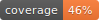

<h1 align="center">kebbie</h1>
<p align="center">
A small framework to test and compare mobile keyboards
</p>

<p align="center">
    <a href="https://github.com/FleksySDK/kebbie/releases"></a>
    <a href="https://github.com/FleksySDK/kebbie/actions/workflows/pytest.yaml"></a>
    <a href="https://github.com/FleksySDK/kebbie/actions/workflows/lint.yaml"></a>
    
    <a href="https://FleksySDK.github.io/kebbie"></a>
    <a href="https://github.com/FleksySDK/kebbie/blob/main/LICENSE"></a>
</p>

<p align="center">
  <a href="#description">Description</a> •
  <a href="#install">Install</a> •
  <a href="#usage">Usage</a> •
  <a href="#contribute">Contribute</a>
  <br>
  <a href="https://FleksySDK.github.io/kebbie/" target="_blank">Documentation</a>
</p>


<h2 align="center">Description</h2>

`kebbie` is a small framework for **testing and benchmarking mobile keyboards**.  
The primary goal of this package is to establish a *cohesive* and *standardized* method for evaluating the various NLP capabilities of a mobile keyboard and comparing them to existing alternatives.

`kebbie` achieves this through the following two features :

* An easy-to-use evaluation function that facilitates the testing of multiple NLP functionalities offered by a mobile keyboard : *auto-correction*, *auto-completion*, *next-word prediction*, and *swipe gesture recognition*.
* A command-line interface for running the evaluation on established keyboards, operated within emulator.


<h2 align="center">Install</h2>

Install `kebbie` by running :


```
pip install kebbie
```

---

For development, you can install it locally by first cloning the repository :

```
git clone https://github.com/FleksySDK/kebbie.git
cd kebbie
pip install -e .
```

<h2 align="center">Usage</h2>

If you want to test how well your custom code performs, just declare your own instance of `Corrector`, and run the `evaluate()` function !

For example, here is how to test the auto-correction provided by [`pyspellchecker`](https://github.com/barrust/pyspellchecker) :

```python
import json
from typing import List

from spellchecker import SpellChecker
from kebbie import Corrector, evaluate


class ExampleCorrector(Corrector):
    def __init__(self):
        self.spellchecker = SpellChecker()

    def auto_correct(self, context: str, keystrokes, word: str) -> List[str]:
        cands = self.spellchecker.candidates(word)
        return list(cands) if cands is not None else []


if __name__ == "__main__":
    corrector = ExampleCorrector()
    results = evaluate(corrector)

    # Save the results in a local file for later inspection
    with open("results.json", "w") as f:
        json.dump(results, f, ensure_ascii=False, indent=4)
```

> [!TIP]
> Make sure to check the [full documentation](https://FleksySDK.github.io/kebbie/latest/usage/) for a detailed explanations of how to use the code !

---

If instead you want to test an existing keyboard, then you just have to start `appium`, start your emulator and install the keyboard you want to test, and finally run :

```bash
# For GBoard on Android emulator
kebbie evaluate -K gboard --all_tasks

# For iOS keyboard on iOS emulator
kebbie evaluate -K ios --all_tasks
```

> [!TIP]
> Make sure to check the [full documentation](https://FleksySDK.github.io/kebbie/latest/emulated_keyboard/) for a detailed explanations of how to setup emulators and how to use the command line !


<h2 align="center">Contribute</h2>

To contribute, install the package locally, create your own branch, add your code (and tests, and documentation), and open a PR !

### Pre-commit hooks

Pre-commit hooks are set to check the code added whenever you commit something.

> [!NOTE]
> If you never ran the hooks before, install it with :
> ```bash
> pip install -e .[hook]
> pre-commit install
> ```

Then you can just try to commit your code. If your code does not meet the quality required by linters, it will not be committed. You can just fix your code and try to commit again !

> [!TIP]
> You can manually run the pre-commit hooks with :
> ```bash
> pre-commit run --all-files
> ```

### Tests

When you contribute, you need to make sure all the unit-tests pass. You should also add tests if necessary !

> [!NOTE]
> Install the dependencies for testing with :
> ```bash
> pip install -e .[test]
> ```

You can run the tests with :

```bash
pytest
```

---

Tests are not included in the pre-commit hooks, because running the tests might be slow, and for the sake of developers we want the pre-commit hooks to be fast !

Pre-commit hooks will not run the tests, but it will automatically update the coverage badge !

### Documentation

The documentation should be kept up-to-date. You can visualize the documentation locally by running :

```bash
mkdocs serve
```

> [!NOTE]
> Before running this command, you need to install the documentation dependencies :
> ```bash
> pip install -e .[docs]
> ```
