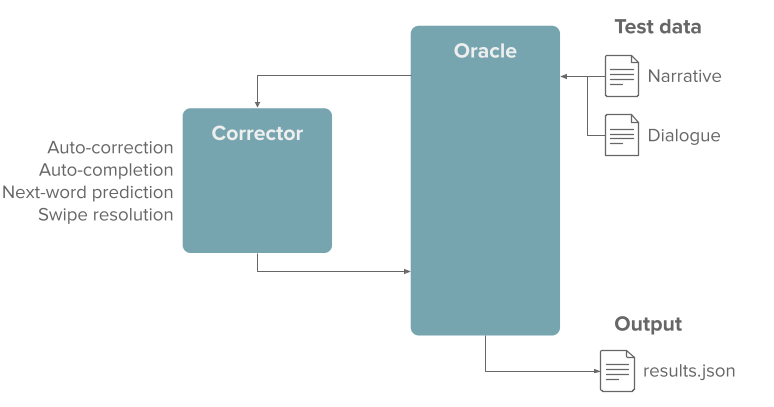
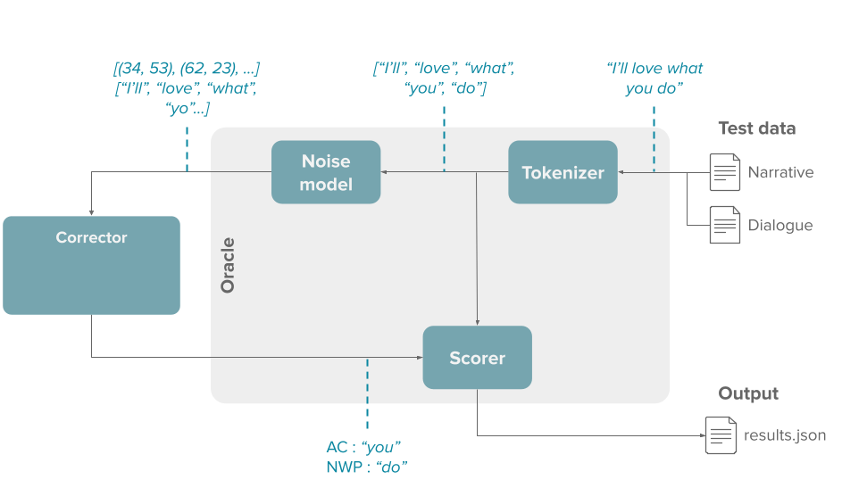
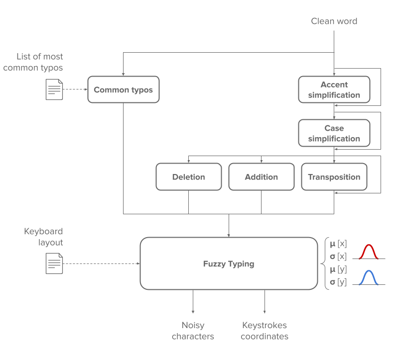

# Architecture

This page presents the internals and design decisions of the `kebbie` package.

## The Oracle

The [Oracle][kebbie.Oracle] is the main class of the package.

It's the class that takes care of iterating the dataset, introducing the artifical typos, and calling the given [Corrector][kebbie.Corrector] with the noisy text. Then it scores the results, knowing what was the expected text, and return the aggregated metrics as a result.

!!! tip "Performances"
    The task is embarassingly parallel. Each sentence can be tested separately. The [Oracle][kebbie.Oracle] leverages multiprocessing to ensure we run the tests as fast as possible.

!!! success "Reproducibility"
    Although The [Oracle][kebbie.Oracle] runs in parallel, the evaluation is entirely reproducible and deterministic. Running twice the same evaluation (with the same [Corrector][kebbie.Corrector] and the same parameters) should give you the exact same results.

If you follow the flow of the data, this is what it looks like :

## The Noise Model

The [NoiseModel][kebbie.noise_model.NoiseModel] is the class responsible for introducing artificial typos in a clean text.

This is done in two steps :

* From a clean word, create a noisy equivalent, which corresponds to a "cognitive" typo (i.e. the user might not know the exact spelling of the word)
* Then from this noisy word, we type each character one by one in a fuzzy way (might type the character next to the intended character), which corresponds to a "physical" typo (i.e. fat finger syndrome)

!!! info
    The keystrokes are generated by using two Gaussian distributions (over the X-axis and the Y-axis), centered on the middle of the intended key.

In the end, the output is a noisy version of the word, alongside with the corresponding keystrokes coordinates.
