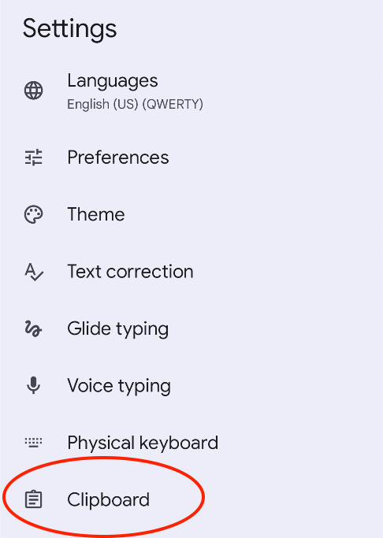
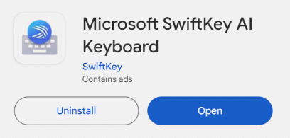
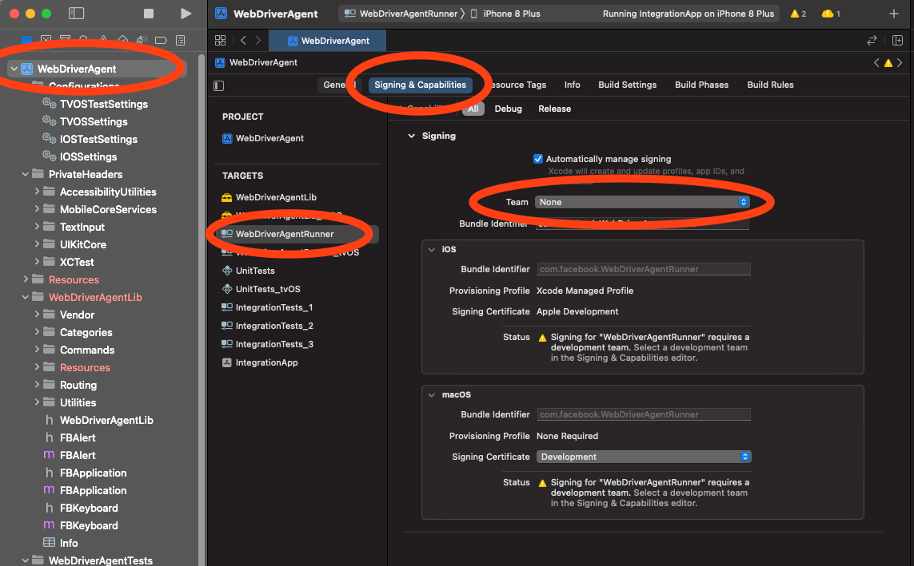
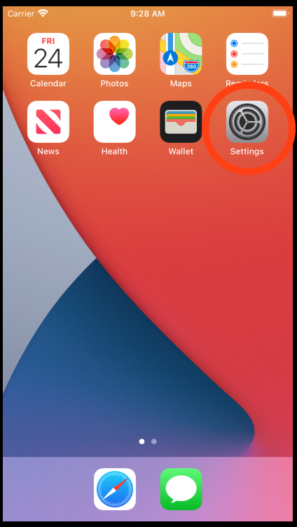
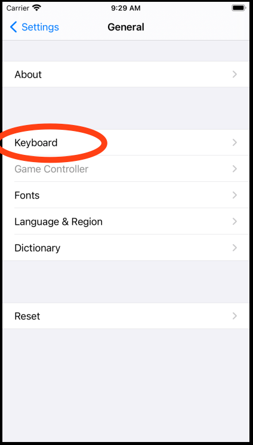

# Emulator setup

## Installing Appium 2.0

Appium is required to communicate between Python and the emulators.

Install Appium 2.0 by following [their official documentation](https://appium.io/docs/en/latest/quickstart/install/).

---

Then install the required drivers :

```bash
# For Android
appium driver install uiautomator2

# For iOS
appium driver install xcuitest
```

---

To start Appium, open a new terminal and type :

```bash
appium
```

!!! info "Note"
    Once it's running, don't close the terminal.  
    Appium needs to run in order for Python to communicate with the emulators.

## Setting up Android emulator

### Creating the emulator

* Install [Android Studio](https://developer.android.com/studio)
* Create a new virtual device

* Select the phone (`Pixel 2` for example) and the system image (`Tiramisu - Android 13.0` for example)

### Starting the emulator

Once you have created the emulator, you should be able to see its name from the command line :

```bash
emulator -list-avds
```

??? failure "If you encounter `command not found: emulator`"
    If the command fails with `command not found: emulator`, you need to update your path accordingly :

    ```bash
    export ANDROID_HOME=/Users/<username>/Library/Android/sdk
    export PATH=$ANDROID_HOME/platform-tools:$ANDROID_HOME/emulator:$PATH
    ```

You can start the emulator directly from the command line with :  
*(so you don't need to run Android Studio, which takes a lot of resources)*

```bash
emulator -avd <name> -no-snapshot-load
```

Once started, make sure you can see it. From another terminal, run :

```bash
adb devices
```

??? failure "If you encounter `command not found: adb`"
    If the command fails with `command not found: adb`, you need to update your path accordingly :

    ```bash
    export ANDROID_HOME=/Users/<username>/Library/Android/sdk
    export PATH=$ANDROID_HOME/platform-tools:$ANDROID_HOME/emulator:$PATH
    ```

!!! info
    In Android, to open the keyboard, we access a notepad website ([www.justnotepad.com](https://www.justnotepad.com)).

    The reason we do that is because it's the easiest way to access a typing field, and it works across versions and emulators.

### Preparing GBoard

GBoard is enabled by default on Android, so there is nothing to do.

!!! tip
    You can make sure GBoard is indeed the selected keyboard by going to the `Settings` -> `System` -> `Languages & Input` -> `On-screen keyboard`.

---

By default, GBoard has the clipboard enabled, and it may interfere with the layout detection. You can disable the clipboard in the settings of GBoard :

{ width="300" align=left }

{ width="300" }

Make sure to disable the clipboard :

{ width="300" }

!!! failure "Layout"
    For now, the only layout supported is `english US`. Make sure this is the layout GBoard is using.

### Preparing Swiftkey

Swiftkey keyboard isn't installed on the emulator by default : you need to install it first.

!!! note
    If you want to run the tests in parallel on several emulators, you need to repeat these steps for each emulator.

Start the emulator, then go to Google, and paste [this link](https://play.google.com/store/apps/details?id=com.touchtype.swiftkey&hl=en_US&gl=US) to install Swiftkey.

!!! tip
    If the clipboard isn't shared with the emulator, open a terminal and run :

    ```bash
    adb shell input text "https://play.google.com/store/apps/details?id=com.touchtype.swiftkey&hl=en_US&gl=US"
    ```

Install the keyboard on your emulator :

{ width="300" }

Open the app, follow the instructions to activate the keyboard.

---

By default, Swiftkey has the clipboard enabled, and it may interfere with the layout detection. You can disable the clipboard. First, access the clipboard settings :

{ width="300" }

{ width="300" }

And disable the clipboard suggestions :

{ width="300" }

## Setting up iOS emulator

### Creating the emulator

* Install [XCode](https://apps.apple.com/us/app/xcode/id497799835?mt=12)
* Open WebDriverAgent in Xcode :
```bash
open ~/.appium/node_modules/appium-xcuitest-driver/node_modules/appium-webdriveragent/WebDriverAgent.xcodeproj
```
* Go to `Signing & Capabilities` of the project :



* Then click "Team" and select your Apple ID
* You should do this for the three following targets : `WebDriverAgentLib`, `WebDriverAgentRunner`, `IntegrationApp`.

---

Now, make sure you can properly build the `WebDriverAgentRunner` target : select it in the top bar and run it (button "play") :


If all the stars are aligned, it should start the emulator !

### Starting the emulator

Once you have ensured the emulator runs properly, you should be able to start it from the command line (without Xcode open).

First, check the list of emulators available :

```bash
xcrun simctl list
```

Example of emulators listed :

```
-- iOS 17.4 --
    iPhone SE (3rd generation) (96ADAD77-ECE6-420E-B56C-505E0C16231B) (Shutdown)
    iPhone 15 (128F95FC-F499-4B09-A3B2-55937BF52B0B) (Shutdown)
    iPhone 15 Plus (86591FC6-B3E7-43A2-9E9B-D4A2A90DAF31) (Shutdown)
    iPhone 15 Pro (9D38F87D-273B-4D8F-8AD5-E901C1974C1E) (Shutdown)
    iPhone 15 Pro Max (15EF57B4-69E6-4369-9534-70692A2023E5) (Shutdown)
    iPad Air (5th generation) (252D522B-CEAA-4085-BE17-A453BC219755) (Shutdown)
    iPad (10th generation) (39F2ADD2-2FCF-44C3-9DC9-4CC4D50875E9) (Shutdown)
    iPad mini (6th generation) (59125B84-4ED1-40C1-8457-3CE824394385) (Shutdown)
    iPad Pro (11-inch) (4th generation) (DB122D71-F358-48DA-B11C-D25305657E7F) (Shutdown)
    iPad Pro (12.9-inch) (6th generation) (1100927A-B631-4678-AB19-02EA4F680537) (Shutdown)
```

Then you can start the device you want with :

```bash
xcrun simctl boot <UUID>
```

For example, to start `iPhone 15 Pro`, you should run :

```bash
xcrun simctl boot 9D38F87D-273B-4D8F-8AD5-E901C1974C1E
```

!!! warning
    The `xcrun simctl boot` command only launch the simulator background service, to launch the foreground GUI, run :

    ```bash
    open -a Simulator
    ```

!!! note
    To shutdown the simulator, run :

    ```bash
    xcrun simctl shutdown <UUID>
    ```

### Preparing iOS Keyboard

iOS Keyboard is the default keyboard on iOS, so there is nothing to do to enable it.

However, predictions and auto-corrections are disabled by default. They should be enabled :

* Go to "Settings" :

{ width="250" }

* Then go to "General" :

{ width="250" }

* Then go to "Keyboard" :

{ width="250" }

* Then enable "Auto-Correction" and "Predictive Text" :

{ width="250" }

---

Also, inline predictions are enabled by default, and it may interfere with `kebbie`. Make sure to turn it off (also in the keyboard settings) :

{ width="250" }

!!! failure "Layout"
    For now, the only layout supported is `english US`. Make sure this is the layout iOS keyboard is using.

### Preparing Fleksy keyboard

[Fleksy](https://www.fleksy.com/) is a fully-featured keyboard SDK. A demo keyboard is provided, allowing anyone to test its performance.

You first need to install the keyboard in your simulator. To do this, start your simulator (see [Starting the emulator](#starting-the-emulator_1)), and then run :

```bash
wget https://github.com/FleksySDK/kebbie/files/15290354/Fleksy.zip
unzip Fleksy.zip
xcrun simctl install <UUID> Fleksy.app
```

!!! tip
    You can find the UUID of your simulator by running : `xcrun simctl list` and finding which one is `Booted`.

Once the app is installed, start it :


Click "Add Keyboard" :

{ width="250" }

Then go to "General" :

{ width="250" }

Then go to "Keyboard" :

{ width="250" }

Then go to "Keyboards" :

{ width="250" }

Then click "Add New Keyboard" :

{ width="250" }

And select "Fleksy For Research" :

{ width="250" }

Then select the Fleksy keyboard you just installed :

{ width="250" }

And enable "Full Access" :

{ width="250" }

---

Once enabled, you still need to select the right keyboard ! Open the keyboard using any text field, and hold the switch keyboard key. You can then select the keyboard you want to test :

{ width="250" }

---

And similarly to the default iOS keyboard, you should enable predictions and auto-corrections :

* Go to "Settings" :

{ width="250" }

* Then go to "General" :

{ width="250" }

* Then go to "Keyboard" :

{ width="250" }

* Then enable "Auto-Correction" and "Predictive Text" :

{ width="250" }


### Preparing KeyboardKit

[KeyboardKit](https://keyboardkit.com/) is an open-source SDK that lets you create a custom keyboard. They provide a demo keyboard that we can use to test its performance.

Before being able to run `kebbie evaluate` to benchmark KeyboardKit, you need to install the demo keyboard on your simulator.

First, clone the repository and open the project in Xcode :

```bash
git clone https://github.com/KeyboardKit/KeyboardKit.git
cd KeyboardKit
open Demo/Demo.xcodeproj
```

Then, from Xcode, select the `Demo` project, select the right simulator, and press the play button :


It should start the simulator, with KeyboardKit installed.

---

Once the simulator started, you need to enable the KeyboardKit keyboard and allow full access :

{ width="250" }

{ width="250" }

{ width="250" }

---

Once enabled, you still need to select the right keyboard ! Open the keyboard using any text field, and hold the switch keyboard key. You can then select the keyboard you want to test :

{ width="250" }

---

And similarly to the default iOS keyboard, you should enable predictions and auto-corrections :

* Go to "Settings" :

{ width="250" }

* Then go to "General" :

{ width="250" }

* Then go to "Keyboard" :

{ width="250" }

* Then enable "Auto-Correction" and "Predictive Text" :

{ width="250" }

## Parallel emulators

In order to run tests faster, we can setup multiple emulators, and run the [evaluate()][kebbie.evaluate] function in parallel. Let's see how to set up multiple emulators for both Android and iOS.

### Android

First, follow the section above to [setup one Android emulator](#setting-up-android-emulator).

Once it's done, you can simply clone it from Android Studio :


Clone it several times. Once the emulators are created, you should be able to list them from the command line :

```bash
emulator -list-avds
```

Then open several terminal, and in each terminal open one emulator :

```bash
emulator -avd <name> -no-snapshot-load
```

After they started, you should be able to see them with :

```bash
adb devices
```

!!! tip
    Once you can see the emulators with the `adb devices` command, there is nothing else to do ! You can run the `kebbie` CLI just like you would do for a single emulator : the CLI will detect the running emulators with the `adb devices` command.

### iOS

First, follow the section above to [setup one iOS simulator](#setting-up-ios-emulator) and make sure everything works for a single device.

Once it's done, you can list the device availables :

```bash
xcrun simctl list
```

Example of emulators listed :

```
-- iOS 17.4 --
    iPhone SE (3rd generation) (96ADAD77-ECE6-420E-B56C-505E0C16231B) (Shutdown)
    iPhone 15 (128F95FC-F499-4B09-A3B2-55937BF52B0B) (Shutdown)
    iPhone 15 Plus (86591FC6-B3E7-43A2-9E9B-D4A2A90DAF31) (Shutdown)
    iPhone 15 Pro (9D38F87D-273B-4D8F-8AD5-E901C1974C1E) (Shutdown)
    iPhone 15 Pro Max (15EF57B4-69E6-4369-9534-70692A2023E5) (Shutdown)
    iPad Air (5th generation) (252D522B-CEAA-4085-BE17-A453BC219755) (Shutdown)
    iPad (10th generation) (39F2ADD2-2FCF-44C3-9DC9-4CC4D50875E9) (Shutdown)
    iPad mini (6th generation) (59125B84-4ED1-40C1-8457-3CE824394385) (Shutdown)
    iPad Pro (11-inch) (4th generation) (DB122D71-F358-48DA-B11C-D25305657E7F) (Shutdown)
    iPad Pro (12.9-inch) (6th generation) (1100927A-B631-4678-AB19-02EA4F680537) (Shutdown)
```

Select the UUID of the device you would like to run in parallel, and clone it with :

```bash
xcrun simctl clone <UUID> <new_name>
```

So for example, to have 4 parallel `iPhone 15 Pro`, you should run :

```bash
xcrun simctl clone 9D38F87D-273B-4D8F-8AD5-E901C1974C1E iPhone_15_2
xcrun simctl clone 9D38F87D-273B-4D8F-8AD5-E901C1974C1E iPhone_15_3
xcrun simctl clone 9D38F87D-273B-4D8F-8AD5-E901C1974C1E iPhone_15_4
```

---

Once this is done, you should see them listed when running :

```bash
xcrun simctl list
```

```
-- iOS 17.4 --
    iPhone SE (3rd generation) (96ADAD77-ECE6-420E-B56C-505E0C16231B) (Shutdown)
    iPhone 15 (128F95FC-F499-4B09-A3B2-55937BF52B0B) (Shutdown)
    iPhone 15 Plus (86591FC6-B3E7-43A2-9E9B-D4A2A90DAF31) (Shutdown)
    iPhone 15 Pro (9D38F87D-273B-4D8F-8AD5-E901C1974C1E) (Booted)
    iPhone_15_2 (C423F3BC-BC3A-4FFC-B264-C6075B60115F) (Shutdown)
    iPhone_15_3 (2BEB33D0-8F33-4987-95FC-FD9B7C2BD54D) (Shutdown)
    iPhone_15_4 (EE0719E9-FF3C-4539-9BCD-9F091B469F93) (Shutdown)
    iPhone 15 Pro Max (15EF57B4-69E6-4369-9534-70692A2023E5) (Shutdown)
    iPad Air (5th generation) (252D522B-CEAA-4085-BE17-A453BC219755) (Shutdown)
    iPad (10th generation) (39F2ADD2-2FCF-44C3-9DC9-4CC4D50875E9) (Shutdown)
    iPad mini (6th generation) (59125B84-4ED1-40C1-8457-3CE824394385) (Shutdown)
    iPad Pro (11-inch) (4th generation) (DB122D71-F358-48DA-B11C-D25305657E7F) (Shutdown)
    iPad Pro (12.9-inch) (6th generation) (1100927A-B631-4678-AB19-02EA4F680537) (Shutdown)
```

Then you can start each simulator with :

```bash
xcrun simctl boot <UUID>
```

For example, to start the 4 simulators we just created, you would run :

```bash
xcrun simctl boot 9D38F87D-273B-4D8F-8AD5-E901C1974C1E
xcrun simctl boot C423F3BC-BC3A-4FFC-B264-C6075B60115F
xcrun simctl boot 2BEB33D0-8F33-4987-95FC-FD9B7C2BD54D
xcrun simctl boot EE0719E9-FF3C-4539-9BCD-9F091B469F93
```

!!! tip
    Once the simulators started, there is nothing else to do ! You can run the `kebbie` CLI just like you would do for a single emulator : the CLI will automatically detect the running emulators with the `xcrun simctl list` command.

    However, make sure to enable auto-correction and predictive suggestions in each of the simulator (see [Preparing the iOS Keyboard](#preparing-ios-keyboard) for more information)

!!! warning
    The `xcrun simctl boot` command only launch the simulator background service, to launch the foreground GUI, run :

    ```bash
    open -a Simulator
    ```

!!! note
    To shutdown a simulator, run :

    ```bash
    xcrun simctl shutdown <UUID>
    ```
