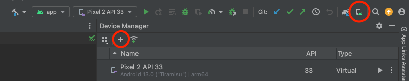

# Emulator setup

## Installing Appium 2.0

Appium is required to communicate between Python and the emulators.

Install Appium 2.0 by following [their official documentation](https://appium.io/docs/en/latest/quickstart/install/).

---

To start Appium, open a new terminal and type :

```bash
appium
```

!!! info "Note"
    Once it's running, don't close the terminal.  
    Appium needs to run in order for Python to communicate with the emulators.

## Setting up Android emulator

### Creating the emulator

* Install [Android Studio](https://developer.android.com/studio)
* Create a new virtual device

* Select the phone (`Pixel 2` for example) and the system image (`Tiramisu - Android 13.0` for example)

### Starting the emulator

Once you have created the emulator, you should be able to see its name from the command line :

```bash
emulator -list-avds
```

??? failure "If you encounter `command not found: emulator`"
    If the command fails with `command not found: emulator`, you need to update your path accordingly :

    ```bash
    export ANDROID_HOME=/Users/<username>/Library/Android/sdk
    export PATH=$ANDROID_HOME/platform-tools:$ANDROID_HOME/emulator:$PATH
    ```

You can start the emulator directly from the command line with :  
*(so you don't need to run Android Studio, which takes a lot of resources)*

```bash
emulator -avd <name>
```

Once started, make sure you can see it. From another terminal, run :

```bash
adb devices
```

??? failure "If you encounter `command not found: adb`"
    If the command fails with `command not found: adb`, you need to update your path accordingly :

    ```bash
    export ANDROID_HOME=/Users/<username>/Library/Android/sdk
    export PATH=$ANDROID_HOME/platform-tools:$ANDROID_HOME/emulator:$PATH
    ```

### Preparing the emulator

When we run the tests on emulator, we need to access a typing field, and type the words there while monitoring the suggestions and the corrected words.

But not all typing fields are equal ! Some typing fields (like URL field, or search field) have AC disabled by default.

On Android, we access the Google Message app, and compose a new message (in this field, the AC is enabled by default).

But the first time you access the app on Android, a pop-up appears, requiring user intervention. If you try to run the tests without closing this pop-pup, the layout detection will fails and the testing function will fail.

So, before running any tests on a freshly installed emulator, open the Google Message app manually :

{ width="250" }

And when the pop-up appears, discard it so it doesn't appear again :

{ width="300" }

!!! info "Note"
    Depending on your version of the Google Message app, the pop-up might be different.

    Or there might be several pop-ups to close, when you open the app for the second or third time. Just make sure to close them all until they don't appear anymore upon starting the app.

### Preparing GBoard

GBoard is enabled by default on Android, so there is nothing to do.

!!! tip
    You can make sure GBoard is indeed the selected keyboard by going to the `Settings` -> `System` -> `Languages & Input` -> `On-screen keyboard`.

---

By default, GBoard has the clipboard enabled, and it may interfere with the layout detection. You can disable the clipboard in the settings of GBoard :

{ width="300" align=left }

{ width="300" }

Make sure to disable the clipboard :

{ width="300" }

## Setting up iOS emulator

TODO

## Parallel Android emulators

In order to run tests faster, we can setup multiple Android emulators, and run the [evaluate()][kebbie.evaluate] function in parallel.

First, follow the section above to [setup one Android emulator](#setting-up-android-emulator).

Once it's done, you can simply clone it from Android Studio :


Clone it several times. Once the emulators are created, you should be able to list them from the command line :

```bash
emulator -list-avds
```

Then open several terminal, and in each terminal open one emulator :

```bash
emulator -avd <name>
```

After they started, you should be able to see them with :

```bash
adb devices
```

!!! tip
    Once you can see the emulators with the `adb devices` command, there is nothing else to do ! You can run the `kebbie` CLI just like you would do for a single emulator : the CLI will detect the running emulators with the `adb devices` command.
