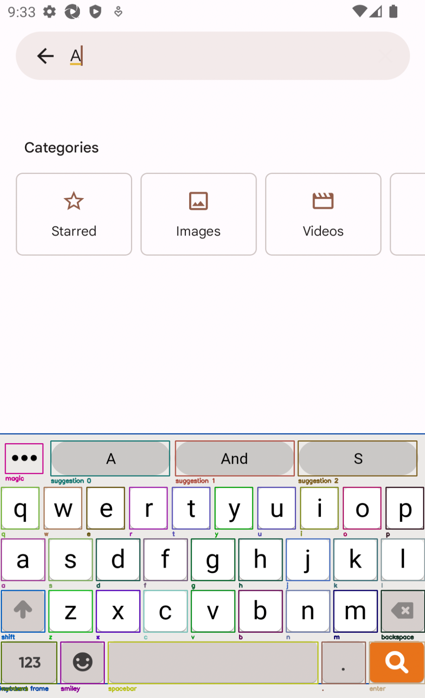

# Emulated keyboards

In [Usage](usage.md), we saw how to use the `kebbie` framework to test our code and get various metrics to understand how good our custom auto-correction was.

Now, let's see how to use the `kebbie` CLI to run similar tests on an existing keyboard (within an emulator) such as GBoard.

## Setup

First, you need to install and setup Appium and the emulators.

Follow the intructions in [Emulator setup](emu_setup.md).

---

Once everything you need is installed, you should have the following running :

* Appium in a terminal
* At least one emulator

## Layout detection

`kebbie` tries to automatically detect the layout of the keyboard in use. It is working for GBoard for example.

But some keyboards cannot be detected automatically. In this case we rely on a manual definition of the layout.

But these manual definitions of the layout may not fit all devices.

`kebbie` provides a CLI to check the layout. To visualize the keyboard's layout, run the following command :

```bash
kebbie show_layout
```

It will display 3 images (one for each layer of the keyboard : `lowercase`, `uppercase`, `numbers`), so you can see if the layout (automatically detected or manually defined) fits the current keyboard. You can leave the images by pressing any key.

!!! info
    Before leaving, the command will also display in the terminal the detected suggestions of the keyboard. If they don't correspond to what's displayed in the emulator, something might be wrong !

    For auto-detected keyboards, these suggestions are retrieved directly from the XML tree (fast and accurate). For keyboards with manual layout, we use OCR to find the suggestions (slow and may be wrong).

!!! tip
    If you have several emulators running, `kebbie show_layout` will find and display the layout for each emulator, one by one.

Example where the layout match the keys properly :

{ width="300" }

Example where the layout doesn't match the keyboard's keys :

{ width="300" }

!!! experiment "If it doesn't match..."
    You need to modify the definition of the layout (in [emulator.py](internals.md#emulatorpy)), and experiment with new coordinates until it matches well...

## Testing the keyboard

After you made sure the layout is properly detected / defined, it's time to run the tests !

Simply run :

```bash
kebbie evaluate --all_tasks
```

After a while, you should see the emulator start typing sentences !

The command line will type the sentences from the test data, and record the suggestions and the auto-corrections from the keyboard.

Once all sentences are tested, the results will be saved in a file `results.json`.

!!! info
    The `kebbie evaluate` CLI will use only 100 sentences of the test data (versus 2 000 by default for the [evaluate()][kebbie.evaluate] function, see [Usage](usage.md)).

    This is because typing on an emulated keyboard is significantly slower. 100 sentences is enough to get some good, comparable metrics.

---

Note that we specified the option `--all_tasks`. With this option, we are computing the results for all of the tasks supported by the emulator : *auto-correction*, *auto-completion*, and *next-word prediction*.

!!! failure "Unsupported"
    For now, *swipe gesture recognition* is not supported for the emulated keyboards.

The default behavior (when `--all_tasks` is not specified) is to run only the *auto-correction* task. It is significantly faster, specially for keyboards with a layout defined manually, because they require OCR, which is quite slow.

---

If you want to change the number of sentences the CLI run on, just use the option `--n_sentences` :

```bash
kebbie evaluate --all_tasks --n_sentences 10
```

---

You can change the destination file for the results with the option `--result_file` :

```bash
kebbie evaluate --all_tasks --result_file my/folder/evaluation_results.json
```
