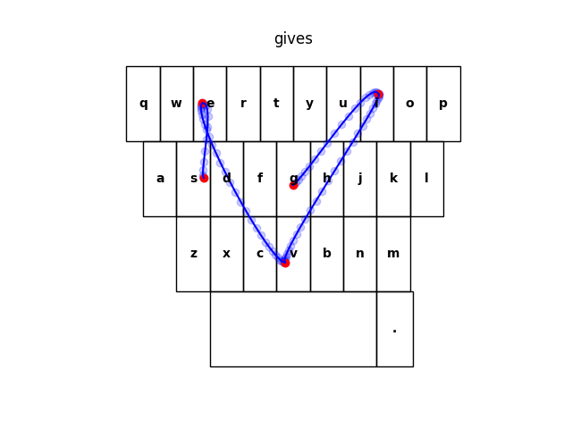
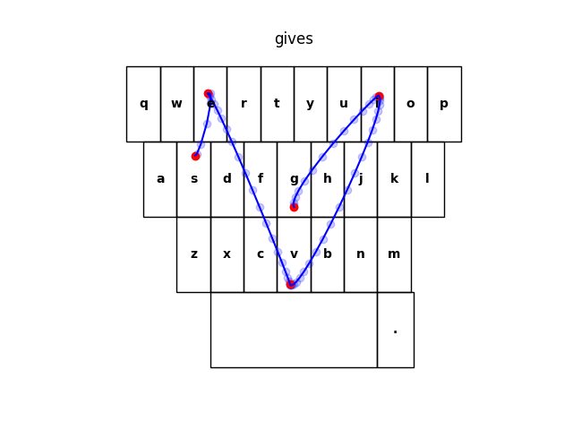
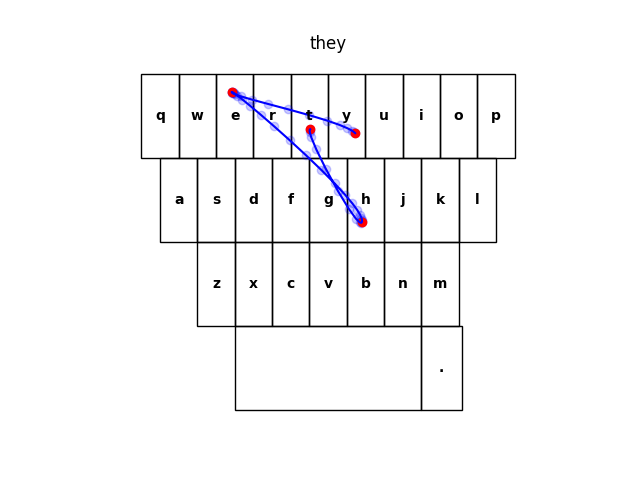
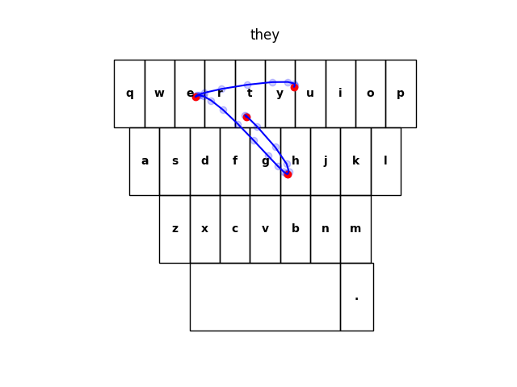
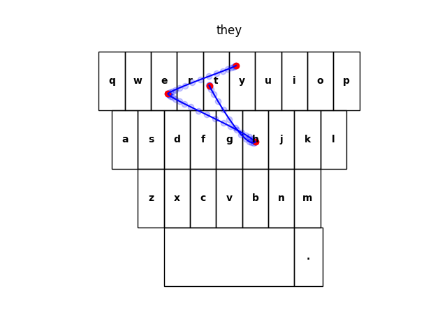

# How testing is done ?

The basic idea is simple : we take a dataset of english sentences, we corrupt these sentences by introducing artificially generated typos, and then we measure how these typos are corrected.

## Artificial typos

To introduce typos in the clean text, we simulate all possible typos that a human typing on a mobile keyboard could do. This include :

* Characters additions / deletions
* Characters transpositions
* Accent simplifications
* Case simplifications
* Fat-finger syndrome (fuzzy typing)
* Common typos (sampled from a dataset of most common typos)

---

We use the following typo rates :

* Character transpositions : 1% of all characters
* Character additions : 0.5% of all characters
* Character deletions : 0.5% of all characters
* Space deletions : 1% of all space characters
* Symbol deletions : 10% of symbol characters
* Accent simplification : 8% of accented characters
* Case simplification : 8% of uppercased characters
* Common typos : 5% of words

With these rates, we obtain an overall typo rate of **12%**.

!!! success "Sources"
    These rates come from studies on real-human typing habits : [Reference #1](https://userinterfaces.aalto.fi/typing37k/resources/Mobile_typing_study.pdf), [Reference #2](https://arxiv.org/pdf/2005.01158.pdf).

    Particularly, Reference #1 (which focus on mobile device typing) shows that typing on mobile devices leads to 2.3% of uncorrected errors (see introduction), and 8% of words autocorrected (see Intelligent text entry, page 8), for an overall typo rate of **10.3%**.

??? abstract "Details"
    Additionally to these typo rates, we further modify the probabilities :

    * [FRONT_DELETION_MULTIPLIER][kebbie.noise_model.FRONT_DELETION_MULTIPLIER] is used to reduce the probability of a deletion happening on the first character of the word. This number was computed after analyzing the [Tweeter typo corpus](https://luululu.com/tweet/) (see [this script](https://gist.github.com/astariul/359f2bda89d77b49721ed77db1b54f00))

---

Here is a few examples of sentences before and after introducing typos :

|                         Clean sentence                        |                      Corrupted sentence                      |                 Typos introduced                 |
|:-------------------------------------------------------------:|:------------------------------------------------------------:|:------------------------------------------------:|
| He went hiking and said he'd think about it; never came back. | He went hikimg and said hed think about it; never came back. | Fuzzy typing & Symbol deletion                   |
|    Like, what you're doing here and what all this stuff is.   |    Like, what you're doinghere and waht all this stuff is.   | Space deletion & Character transposition         |
|             You must do something about yourself.             |             You must do something about yourself.            |                                                  |
|         That's the way to get rid of pests like that.         |        That's the waj to get rid of pedts like thhat.        | Common typo & Fuzzy typing & Character addition  |
|                  He obviously wanted an ally.                 |                 he obviously wanted an ally.                 | Case simplification                              |
|        This is all we got between us and the Almighty!        |        This is lal we got beween us and the Almgihty!        | 2 x Character transposition & Character deletion |

## Swipe gesture generation

For the task of swipe gesture resolution, the input is not simple text : we need to generate a swipe gesture.

When generating fuzzy typing typo, we sample key taps positions on the keyboard, using Gaussian distributions, and use these key taps position to see if the correct character was typed, or if a neighbor key was typed.

For generating the swipe gesture, we sample some key taps positions just like we do for fuzzy typing, and then link the different keystrokes of the word using bezier curves. Some randomness on the speed & acceleration between points is added, in order to generate more natural swipe gestures.

Here is some examples of the generated swipe gestures (in red are the keystrokes generated by the fuzzy typing, in blue the points of the corresponding swipe gesture created).

For the word `gives` :

For the word `they` :

## Data

### Test data

For the data, we use the test set of the [SODA dataset](https://huggingface.co/datasets/allenai/soda).

We chose to use this dataset for the evaluation for several reasons :

* Recent
* Extremely clean dataset
* Cover two very distinct domains (`narrative` & `dialogue`)

### Common typos dataset

As mentioned in the section [Artificial typos](#artificial-typos), we rely on a dataset of common typos, and use these common typos when generating plausible typos.

The dataset of common typos that we use is the [Twitter Typo Corpus](https://luululu.com/tweet/).

## Tasks

We test the most important NLP features of a mobile keyboards. These are :

* **Auto-correction**: Corrects the words typed by the user.  
For example, if a user types `I’m especialy touched`, the typo should be detected and corrected to `I’m especially touched`.
* **Auto-completion**: Completes the word typed by the user.  
For example, if a user types `I love y`, the word should be auto-completed to `I love you`.
* **Next-word prediction**: Predicts the next word to be typed.  
For example, if a user types `I want to eat french`, a probable next word can be `fries`.
* **Swipe gesture resolution**: Predicts the intended word from a swipe gesture.

## Metrics

If you look into the results from `kebbie`, for each task we have a handful of metrics that help us understand how good the tested keyboard is. Let's look at the details of these metrics.

### Formulas

#### Next-word prediction, swipe resolution, auto-completion

For these three tasks, the metric used is **Accuracy**.

The formula is : `accuracy = correct / total`

Where `correct` is the number of correct predictions, and `total` the total number of predictions.

---

For the next-word prediction task and auto-completion task, we use top-3 accuracy as the main reference metric. It’s the same as accuracy, but instead of considering only one candidate (which is either correct or not), we consider the 3 most probable candidates (if any one of these 3 candidates is correct).

The reason for this is because the next-word predictions and auto-completion predictions are not “forced” upon the user : 3 predictions are displayed at the top of the keyboard, and the user can choose any of the prediction displayed. So the correct prediction should appear among these 3 predictions displayed.

For swipe resolution however, only the best prediction is selected and applied. So we use accuracy as the main reference metric (and not top-3 accuracy).

#### Auto-correction

For auto-correction, it’s different. We have a notion of true/false positive/negative. Let’s first define these notions :

* **True Negative** : No typo introduced, the model doesn’t correct anything
* **False Positive** : No typo introduced, but the model correct (wrongly) the word
* **True Positive** : A typo is introduced, the model correct the word into the expected word
* **False Negative** : A typo is introduced, but the model doesn’t correct anything

With an example it’s easier to visualize :

|                | Word typed by the user | Word after being corrected by the model | Expected word |
|:--------------:|:----------------------:|:---------------------------------------:|:-------------:|
|  True Negative |          love          |                   love                  |      love     |
| False Positive |          love          |                   loev                  |      love     |
|  True Positive |          loev          |                   love                  |      love     |
| False Negative |          loev          |                   loev                  |      love     |

From these notions, we can compute the following metrics : accuracy, precision, recall, F-score, using the following formulas :

`accuracy = (tp + tn) / (tp + tn + fp + fn)`

`precision = tp / (tp + fp)`

`recall = tp / (tp + fn)`

`f_score = 2 * (precision * recall) / (precision + recall)`

!!! info "Note"
    F-score is the harmonic mean of precision and recall. It’s a way to gather both precision and recall in a single metric.

!!! warning "Important"
    Actually we use Fβ-score, which is a variant of the F-score where we can use a constant β to weight the precision/recall ratio (see the [wikipedia page about F-score](https://en.wikipedia.org/wiki/F-score)).

    This is useful because we value precision more.

    We currently use [β = 0.9][kebbie.scorer.DEFAULT_BETA], which means precision has slightly more weight than recall.

### Understanding the metrics

#### Swipe resolution

`Accuracy` - `[0 - 1]` - `higher is better`

Accuracy is straightforward : this is the ratio of correct predictions.

So an accuracy of `0.8` means the model correctly predicted the word being swiped 80% of the time.

#### Next-word prediction & auto-completion

`Top-3 accuracy` - `[0 - 1]` - `higher is better`

Same as accuracy, but 3 candidates are considered.

So a top-3 accuracy of `0.6` means that within the 3 candidates predicted by the model, the next word (or the word completion) is in these 3 candidates 60% of the time.

#### Auto-correction

`Precision` - `[0 - 1]` - `higher is better`

Precision is the ratio of typos among what is corrected by the model.

So a precision of `0.7` means that among all corrections made by the model, 70% were actually typos (and 30% were correct words that didn’t need to be corrected).

A low precision means many words are corrected when they should not, and a high precision means only actual typos are corrected.

---

`Recall` - `[0 - 1]` - `higher is better`

Recall is the ratio of typos detected by the model.

So a recall of `0.65` means that the model correctly detected 65% of typos (and 35% of typos were not corrected by the model).

A low recall is symptom that most typos are not detected, and a high recall means most of typos are detected as typos.

---

`F-score` - `[0 - 1]` - `higher is better`

F-score is the harmonic mean of precision and recall, it’s just a way to gather both precision and recall in a single metric.

Note that we weight precision slightly more than recall.
