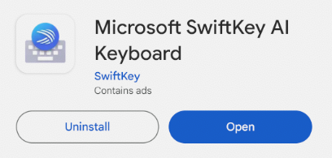
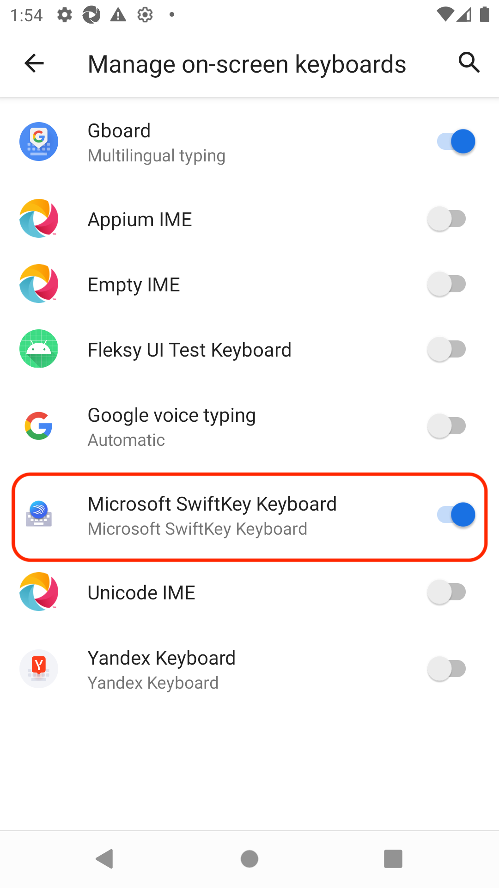
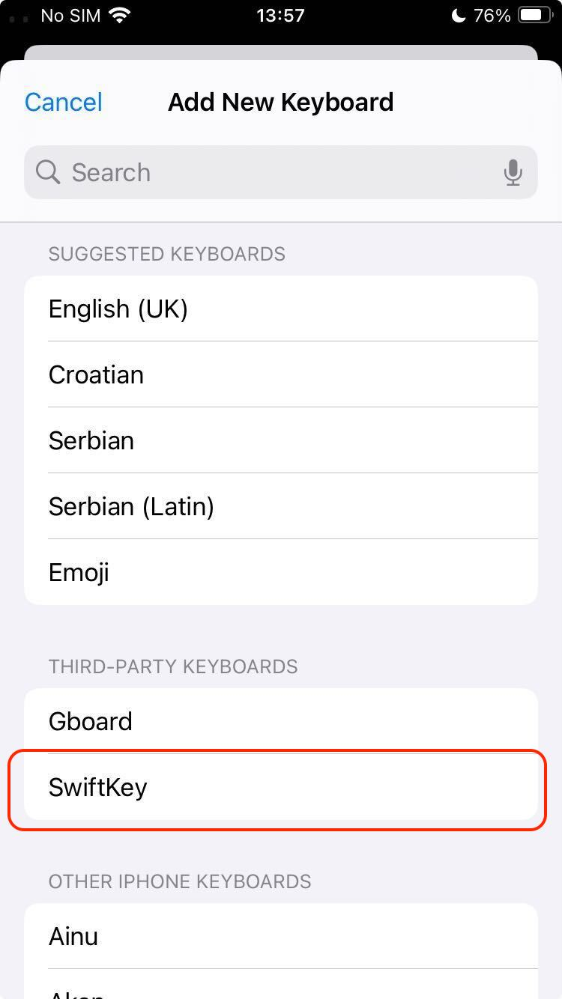
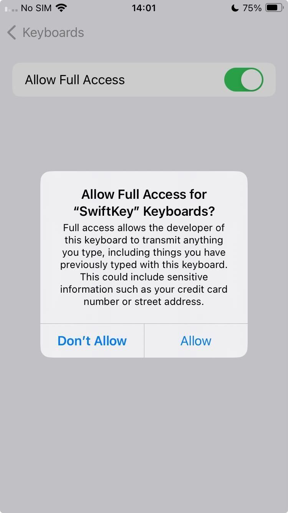

# Test a new keyboard

To be able to test a keyboard not supported yet by Kebbie you will need to do some steps before run the tests.


## Device setup
To get the elements of the keyboard to be able to map the keys and then evaluate the keyboard you need to have Appium 2 correctly installed and the emulator ready. 

So you need to:

* Setup Appium by following the [emulator setup](emu_setup.md#installing-appium-20) documentation.
* Setup the emulator by following the [emulator setup](emu_setup.md#setting-up-android-emulator) documentation.


## Installing the keyboard on the device
First of all install the APK manually if you have the file locally or download it from the app the store:

{ width="300" }

Once it's installed, if it hasn't any setup wizard, access to the on-screen keyboard settings to enable and select it.

Example for Android:

{ width="300" }

Example for iOS:

{ width="300" }

!!! warning
    On iOS keyboards you will need to allow the full access permission.

    { width="300" }


## Add a new keyboard to Kebbie:
Add the name of the new keyboard in the available choices in the [cmd.py](internals.md#cmdpy) file.

Example:

```bash
choices = ["newKeyboard", "gboard", "tappa", "ios", "kbkitpro", "fleksy"]
```

Add it in the file [emulator.py](internals.md#emulatorpy) file.

Example:

```bash
NEWKEYBOARD = "newkeyboard"
```

And in the [instantiate_correctors](internals.md#instantiate_correctors) list in the [cmd.py](internals.md#cmdpy) file if it's an Android keyboard.

Then add it the `KEYBOARD_PACKAGE` list in the [emulator.py](internals.md#emulatorpy) file to automatically select it before the keys mapping or the keyboard evaluation and to filter the page source if you want to map the keys.

!!! success "Tip"
    To get the package of the new keyboard, once it's installed on the device, just run the command `adb shell pm list packages -3 | cut -f 2 -d ":"` and search it in the list.


## Get full keyboard locators:

Run the command `kebbie get_page_source -K newKeyboard` on your code. The device will open a web browser and show the keyboard currently selected. After that, the system will get all the locators on screen and save them in an XML file.

!!! success "Tip"
    If you have set the keyboard package, you will get the information automatically filtered by the keyboard locators to find the keys and suggestions easier.

!!! info "Note"
    You can show that information directly on console just adding the parameter `--print_page_source` or `-P` to the `get_page_source` command.

!!! warning "Important"
    If there is no keyboard package set, or it is not found in the data gathered, the system will save the whole page source without filtering it.


Once you have all the locators related with the keyboard, find the root element of the keyboard, the keyboard keys and suggestions elements

!!! success "Tip"
    You can usually find the keys by the `content-desc` or the `text` of their elements, if not, try to find the `resource-id` value.

!!! success "Tip"
    To find the suggestions easier, type something with the keyboard to show up the suggestions just before get the page source, then you will be able to find the locators by searching the text of those suggestions.


## Get the keyboard layout

Create a layout detector class with the keyboard name adding the methods to get the root, the keys and the suggestions (see the `GboardLayoutDetector` class for an example)

Example copying and editing the Gboard layout detector:

```bash
class NewKeyboardLayoutDetector(LayoutDetector):
    """Layout detector for the NewKeyboard keyboard. See `LayoutDetector` for more
    information.
    """

    def __init__(self, *args, **kwargs):
        super().__init__(
            *args,
            xpath_root=f"./*/*[@package='{KEYBOARD_PACKAGE[NEWKEYBOARD]}']",
            xpath_keys=".//*[@resource-id][@content-desc]",
            **kwargs,
        )

    def get_suggestions(self) -> List[str]:
        """Method to retrieve the keyboard suggestions from the XML tree.

        Returns:
            List of suggestions from the keyboard.
        """
        suggestions = []

        sections = [
            data
            for data in self.driver.page_source.split("<android.widget.FrameLayout")
            if KEYBOARD_PACKAGE[NEWKEYBOARD] in data
        ]
        for section in sections:
            if "content-desc" in section and "resource-id" not in section and 'long-clickable="true"' in section:
                m = re.search(r"content\-desc=\"([^\"]*)\"", section)
                if m:
                    content = m.group(1)

                    # Deal with emojis
                    emoji = re.match(r"emoji (&[^;]+;)", content)
                    suggestions.append(html.unescape(emoji[1]) if emoji else content)

        return suggestions
```

!!! warning "Important"
    If there is any content in the keyboard that you want to ignore from the mapping, add it in the `CONTENT_TO_IGNORE` dictionary in the [`kebbie/emulator.py`](https://github.com/FleksySDK/kebbie/blob/main/kebbie/emulator.py) file (e.g. `"Gallery"`).

!!! warning "Important"
    If there is any content in the keyboard that you want to map with another name, add it in the `CONTENT_TO_RENAME` dictionary in the [`kebbie/emulator.py`](https://github.com/FleksySDK/kebbie/blob/main/kebbie/emulator.py) file (e.g. `"Find": "enter"`).

Finally, in the `__init__` method in the [`kebbie/emulator.py`](https://github.com/FleksySDK/kebbie/blob/main/kebbie/emulator.py) file, add the name of the keyboard in the `Get the the right layout` section to run its layout detector and add the keyboard to the error handling.

Example:

```bash
elif self.keyboard == NEWKEYBOARD:
    self.detected = NewKeyboardLayoutDetector(self.driver, self._tap)
    self.layout = self.detected.layout
else:
    raise ValueError(
        f"Unknown keyboard : {self.keyboard}. Please specify {NEWKEYBOARD}, {GBOARD}, {TAPPA}, "
        f"{FLEKSY}, {KBKITPRO}, {KBKITOSS} or {IOS}."
    )
```


## Test the new keyboard with Kebbie
First check the key mapping running the command `kebbie show_layout -K newkkeyboard`.

!!! success "Tip"
    If the keys mapping fails trying to get the numbers layout, add a `print(self.driver.page_source)` before the method `self.tap(layout["lowercase"]["numbers"]` and launch the command again to get the key to switch to numbers adding it in the `CONTENT_TO_RENAME` list (e.g. `"Digit keyboard": "numbers"`).

Finally, evaluate the keyboard with the command `kebbie evaluate -K newkeyboard` and wait until the evaluation is finished to get the results.

!!! info "Note"
    See ["How testing is done?"](how_testing_is_done.md) to know the internal process performed.